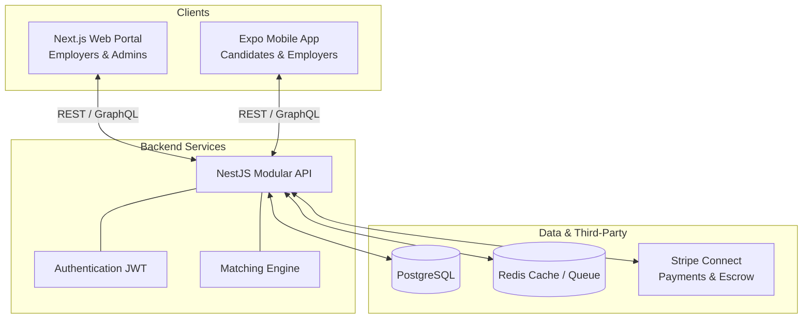
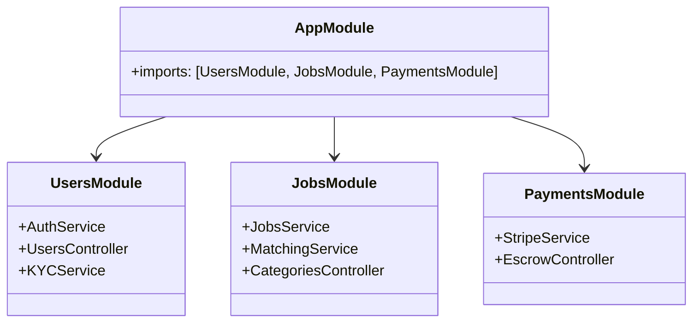
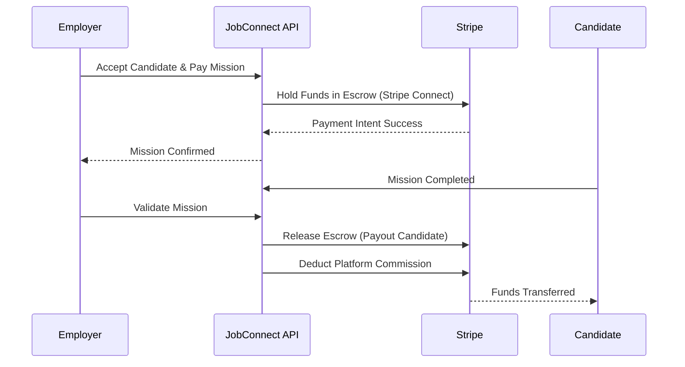

# JobConnect - Temporary Jobs Platform

JobConnect is a full-stack platform connecting individuals for temporary jobs and micro-tasks (cleaning, moving, DIY, babysitting, etc.). The platform allows quick job posting, intelligent matching, and secure escrow payments.

## 🏗️ Architecture Overview

The system follows a modern **Modular Monolith** architecture (3-tier) using a full TypeScript stack. This ensures rapid development for the MVP while maintaining the ability to split into microservices in the future if needed.

### Core Tech Stack

- **Backend API:** Node.js with NestJS (TypeScript)
- **Database:** PostgreSQL with Prisma ORM
- **Web Client (Employer / Admin):** Next.js (React) + TailwindCSS
- **Mobile App (Candidate / Employer):** React Native (Expo)
- **Payments:** Stripe Connect (Escrow & KYC)
- **Infrastructure:** Docker, AWS / Vercel

---

## 📊 System Diagrams

### 1. High-Level Architecture

### 2. NestJS Modular Structure

### 3. Escrow Payment Flow (Stripe Connect)

---

## 🚀 Getting Started

### Prerequisites

- Node.js (v18+)
- PostgreSQL (Local or Docker)
- Yarn or NPM

*(Detailed instructions for running Web, Mobile, and Backend will be provided in their respective directories).*
